# Do Professional CS2 Players Have Distinct Playstyles? An Unsupervised Learning Approach

*A data science deep-dive into what the stats actually say about player archetypes at the top of professional Counter-Strike 2.*

---

  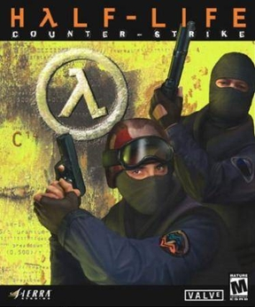

## Introduction

I have been playing Counter-Strike for longer than I care to admit. It started on a family computer in CS 1.6 – the era of pixelated smokes and 64-tick servers – then progressed through CS:GO's ranked matchmaking and global competitive scene, and finally into CS2 in 2023, which rebuilt the engine on Source 2 with volumetric smokes and a proper subtick system. Same DNA, new body.

Playing through all three eras gives you an intuition for the game that is hard to fake. You understand why a player holds a particular angle, why a team might stack one bombsite over another, and why an AWPer having a bad day can unravel an entire strategy. That intuition is exactly what I wanted to test with data.

---

### The Competitive Scene and HLTV

Counter-Strike is one of the world's most-watched esports, structured around Valve's biannual **Major Championships** and a year-round circuit of third-party events including ESL Pro League, BLAST Premier, and IEM. The format is 5-versus-5, with teams alternating between Terrorist and Counter-Terrorist sides across a 24-round match.

[**HLTV.org**](https://www.hltv.org) is the de facto statistics platform for professional Counter-Strike, founded in 2000 and tracking data across every era of the game. For this project, I scraped player data directly from HLTV covering the **last 3 months** (February–May 2026), filtered to matches against top-20 ranked opponents. The result is a dataset of **98 professional players** and 45 features per player.

---

### Understanding the Statistics

**Rating 3.0** is HLTV's composite performance metric, combining kill frequency, survival rate, multi-kill rounds, and impact. A rating of 1.00 is the professional average; above 1.15 is elite. In our dataset, ratings ranged from **0.84** (karrigan, a veteran IGL) to **1.41** (donk).

**KAST** (Kill, Assist, Survive, or Trade) is the percentage of rounds in which a player contributed in at least one of those ways. It measures consistency rather than raw output, with the professional average sitting around 72–74%.

**ADR** (Average Damage per Round) captures damage output regardless of whether it results in a kill – a player who deals 99 damage to an enemy finished by a teammate still contributes to ADR. Elite fraggers typically post ADR above 80; support players often sit in the 65–72 range.

**KPR** and **DPR** (Kills and Deaths per Round) are straightforward. DPR is role-dependent – entry fraggers are expected to die more than AWPers or lurkers.

**T-Rating and CT-Rating** split performance by side. AWPers are often dominant on CT holding angles, while aggressive riflers tend to flip this balance on T side.

**Round Swing** measures how correlated a player's performance is with whether their team wins the round – a strongly positive value means the player is consistently the difference-maker.

**Headshot Percentage** varies sharply by weapon. AWP users have low HS% because the weapon one-shots to any upper-body zone; riflers can push past 60% through precise aim.

**Impact Rating** captures clutch contributions – multi-kill rounds and 1vX situations. **Grenade Damage per Round** reflects utility usage: flashes, HEs, and molotovs that deal damage without earning a kill credit.

For weapon-specific analysis, I collected each player's kill share across four categories: **rifle**, **sniper**, **pistol**, and **SMG**.

---

### Roles in Counter-Strike 2

Professional teams organize around five roles, though boundaries blur in practice.

The **AWPer** holds the team's \$4,750 one-shot sniper rifle, locking down angles on defense and picking off opponents before engagements start. Losing the AWP is an economic disaster, so AWPers must be selective with duels.

The **Entry Fragger** pushes into a site first, creating space for teammates even at the cost of their own life. Their job is to open a round favorably – not to top the scoreboard.

The **Lurker** operates away from the main execution, cutting off rotations or catching defenders out of position for high-impact individual plays.

The **Support** player flashes, smokes, and throws molotovs so teammates can frag. Their value shows up in their teammates' stats more than their own.

The **IGL** (In-Game Leader) calls strategy and sacrifices personal stats to do it. Their statistical signature is typically a below-average rating paired with high grenade damage and assist rates – karrigan, Aleksib, and HooXi are textbook examples.

---

### What This Analysis Is Trying to Find

The central question is simple: **do the statistics tell us anything about how players play, or just how good they are?**

To find out, I applied four unsupervised learning techniques to the dataset:

- **PCA / SVD** – to identify which combinations of features capture the most variance, revealing the true underlying dimensions of player performance.
- **K-Means Clustering** – to partition players into statistically similar groups, with the elbow method and silhouette scores guiding the choice of k.
- **Hierarchical Clustering** – to build a bottom-up tree of player similarities, producing a dendrogram that reveals how players relate at different levels of granularity.

The goal is not to definitively label players with roles – that would require positional and timing data HLTV does not expose publicly. The goal is to see what naturally emerges from the numbers: are there genuine statistical archetypes among professional CS2 players, and if so, what defines them?

---
## Theoretical Background

This section covers the three unsupervised learning methods used in this analysis: Principal Components Analysis (PCA), K-Means Clustering, and Hierarchical Clustering. All methods are discussed in James et al. [1].

---

### Principal Components Analysis (PCA)

PCA finds a low-dimensional representation of a high-dimensional dataset by identifying the directions of greatest variance. The **first principal component** is the normalized linear combination of features that captures the most variance:

$$Z_1 = \phi_{11}X_1 + \phi_{21}X_2 + \cdots + \phi_{p1}X_p$$

where the loading vector $\phi_1 = (\phi_{11}, \ldots, \phi_{p1})^T$ is constrained to $\sum_j \phi_{j1}^2 = 1$. Each subsequent component is orthogonal to the previous ones and maximizes the remaining variance. Geometrically, the first $M$ principal components span the $M$-dimensional subspace closest to the data in terms of average squared Euclidean distance.

**Tuning:** The number of components $M$ is selected using a **scree plot** of the proportion of variance explained (PVE) per component:

$$\text{PVE}_m = \frac{\sum_{i=1}^n z_{im}^2}{\sum_{j=1}^p \sum_{i=1}^n x_{ij}^2}$$

One retains enough components to explain a meaningful share of total variance, looking for an "elbow" in the scree plot, or go by a desired threshold such as 85% or 90%.

**Interpretation:** Loading vectors indicate which features contribute to each component. Observations are interpreted through their scores projected onto the principal component axes.

**Limitations:** PCA assumes linear relationships and is sensitive to variable scaling – features must be standardized before application. Components can also be difficult to interpret when loadings are spread across many variables.

---

### K-Means Clustering

K-Means partitions $n$ observations into $K$ non-overlapping clusters by minimizing total within-cluster variation. Formally, the objective is:

$$\underset{C_1, \ldots, C_K}{\text{minimize}} \sum_{k=1}^K \frac{1}{|C_k|} \sum_{i, i' \in C_k} \sum_{j=1}^p (x_{ij} - x_{i'j})^2$$

The algorithm iterates two steps: (1) assign each observation to the nearest cluster centroid, and (2) recompute centroids as the mean of all assigned observations. This is repeated until assignments stabilize. The algorithm finds a local optimum, so it should be run multiple times with different random initializations, selecting the solution with the lowest objective value.

**Tuning:** $K$ is the primary hyperparameter, selected using the **elbow method** (inertia vs. $K$) and the **silhouette score**, which measures how similar each point is to its own cluster relative to the nearest competing cluster. Silhouette scores range from $-1$ to $1$; higher is better.

**Interpretation:** Each cluster is summarized by its centroid. Cluster profiles are examined by comparing mean feature values across groups.

**Limitations:** K-Means requires $K$ to be specified in advance, assumes roughly spherical clusters of similar size, and is sensitive to outliers. Because it finds local optima, results can vary across runs.

---

### Hierarchical Clustering

Hierarchical clustering builds a nested sequence of groupings without requiring $K$ to be specified in advance. The agglomerative (bottom-up) approach begins with each observation as its own cluster and iteratively merges the two most similar clusters:

1. Compute all $\binom{n}{2}$ pairwise dissimilarities.
2. Fuse the two most similar clusters.
3. Recompute inter-cluster dissimilarities and repeat until all observations are in one cluster.

The result is a **dendrogram** – a tree diagram where the height of each fusion reflects the dissimilarity between merged groups. Clusters are extracted by cutting the dendrogram at a chosen height.

**Linkage:** The choice of linkage method determines how inter-cluster dissimilarity is computed. **Complete linkage** uses the maximum pairwise distance between clusters; **average linkage** uses the mean; **single linkage** uses the minimum. Complete and average linkage are preferred, as single linkage tends to produce elongated, chain-like clusters.

**Tuning:** Key choices are the linkage method and dissimilarity measure (Euclidean distance is standard). The cut height is chosen by visual inspection of the dendrogram.

**Limitations:** Hierarchical clustering assumes a nested cluster structure, which may not reflect reality. Early merges cannot be undone, so errors propagate upward. It is also computationally more expensive than K-Means at large $n$.

---

## Methodology

### Data Collection and Processing

Player statistics were scraped directly from HLTV.org using browser automation, covering the period February 19 – May 19, 2026, filtered to matches against top-20 ranked opponents with a minimum of 10 maps played. This produced a dataset of **98 professional players**. Performance statistics (Rating 3.0, KAST, ADR, KPR, DPR, T/CT rating, round swing, impact rating, multi-kill rate, headshot percentage, grenade damage, save-related metrics, and weapon kill distribution) were collected in one scraping pass, resulting in **40 numeric features** per player.

Distribution inspection revealed that four sniper-related columns – `sniper_kills`, `sniper_pct`, `awp_kills`, and `ssg08_kills` – were heavily zero-inflated, since the majority of players are riflers who rarely touch the AWP. These were replaced with log-transformed equivalents using `log1p` to compress the right tail and prevent the AWPer signal from being distorted by extreme raw values. Two low-information columns (`top_weapon` and `top_weapon_pct`) were dropped.

All 40 features were standardized to zero mean and unit variance using `StandardScaler` before any further analysis. This is essential for both PCA and clustering because without it, features with large absolute scales (e.g. total kills in the hundreds) would dominate those on smaller scales (e.g. assists per round near 0.2).

---

### Principal Component Analysis (PCA)
PCA was applied to the standardized feature matrix using `sklearn.decomposition.PCA` with `n_components=0.9`, which retains the minimum number of components necessary to explain 90% of the total variance. A combined scree plot – showing both individual and cumulative proportion of variance explained – was produced to validate this threshold and examine the decomposition structure. 

The PCA-reduced output was used as input for K-Means. Hierarchical clustering was run on the full 40-feature standardized matrix instead, to preserve fine-grained pairwise similarity structure that dimensionality reduction might discard.

---

### K-Means Clustering

K-Means was applied to the PCA-reduced data with $k$ ranging from 2 to 10. Each model was run with `n_init=20` random initializations to reduce sensitivity to starting conditions, selecting the solution that minimized within-cluster inertia at each $k$. Two metrics guided the choice of $k$:

- **Inertia (elbow plot):** Total within-cluster sum of squares as a function of $k$. A distinct elbow indicates diminishing returns from adding further clusters.
- **Silhouette score:** Ranges from $-1$ to $1$ and measures how much more similar each point is to its own cluster than to the nearest alternative. Higher values indicate more compact, well-separated clusters.

Both metrics were plotted across the full range of $k$ and inspected together to select the final number of clusters. 

---

### Hierarchical Clustering

Agglomerative hierarchical clustering was applied to the full standardized feature matrix using `sklearn.cluster.AgglomerativeClustering` with `distance_threshold=0` and `n_clusters=None`, producing a complete dendrogram for each linkage method. Four linkage strategies were evaluated by visual inspection of their dendrograms. Silhouette scores were then computed on the full standardized feature matrix for Ward clustering across $k = 2$ to $6$, and a silhouette plot was produced. The dendrogram was cut at $k = 2$, $k = 3$, and $k = 4$ using `scipy.cluster.hierarchy.cut_tree`, and each solution was profiled by comparing mean feature values across clusters. The final number of clusters was selected based on both the silhouette scores and the interpretability of the resulting groupings.

---

## Results

### Principal Component Analysis (PCA)

  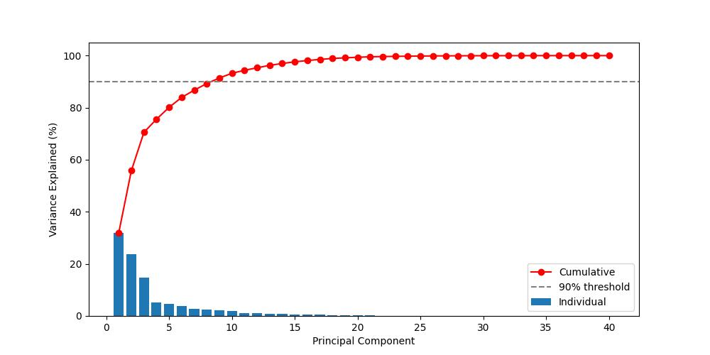

*Figure 1 – Individual and cumulative proportion of variance explained by each principal component. The dashed line marks the 90% threshold.*

The scree plot reveals two things immediately. First, no single component dominates: PC1 captures a meaningful share of variance but far from the majority, and the individual bars decline gradually rather than dropping sharply after the first component. Second, reaching 90% of total variance requires **9 principal components** out of a possible 40.
Player performance is genuinely multi-dimensional as no single axis summarizes the data cleanly. This makes intuitive sense: a player's statistical fingerprint is shaped by several largely independent factors such as how good they are overall, what weapon they prefer, how much playing time they have had, and what role they fill on the team.

Table 1 shows the three largest positive and negative loadings for each of the nine retained components.

| PC | Top positive loadings | Top negative loadings |
|----|----------------------|-----------------------|
| PC1 | KD_Ratio (+0.258), KPR (+0.258), ROUND_SWING (+0.257) | DPR (–0.119), smg_pct (–0.145), smg_kills (–0.084) |
| PC2 | rifle_kills (+0.296), rifle_pct (+0.288), ak47_kills (+0.274) | sniper_pct_log (–0.284), sniper_kills_log (–0.259), awp_kills_log (–0.257) |
| PC3 | Rounds_played (+0.371), Maps_played (+0.367), Total_deaths (+0.343) | ADR (–0.164), Impact_rating (–0.158), MULTI_KILL (–0.146) |
| PC4 | pistol_pct (+0.424), Saved_teammates (+0.312), deagle_kills (+0.272) | smg_kills (–0.384), smg_pct (–0.376), Grenade_dmg (–0.280) |
| PC5 | KAST (+0.388), m4a1_kills (+0.334), KD_Ratio (+0.137) | DPR (–0.373), m4a1s_kills (–0.242), deagle_kills (–0.225) |
| PC6 | m4a1s_kills (+0.386), Grenade_dmg (+0.359), Assists (+0.206) | m4a1_kills (–0.340), smg_kills (–0.333), smg_pct (–0.307) |
| PC7 | pistol_pct (+0.447), m4a1s_kills (+0.399), smg_pct (+0.296) | m4a1_kills (–0.432), Saved_teammates (–0.277), ak47_kills (–0.113) |
| PC8 | Saved_by_teammate (+0.706), Saved_teammates (+0.441), KAST (+0.252) | m4a1_kills (–0.253), deagle_kills (–0.226), Grenade_dmg (–0.161) |
| PC9 | Grenade_dmg (+0.579), Assists (+0.350), pistol_pct (+0.334) | m4a1s_kills (–0.253), ak47_kills (–0.119), glock_kills (–0.110) |

*Table 1 – Top loadings (by absolute magnitude) for each principal component.*

  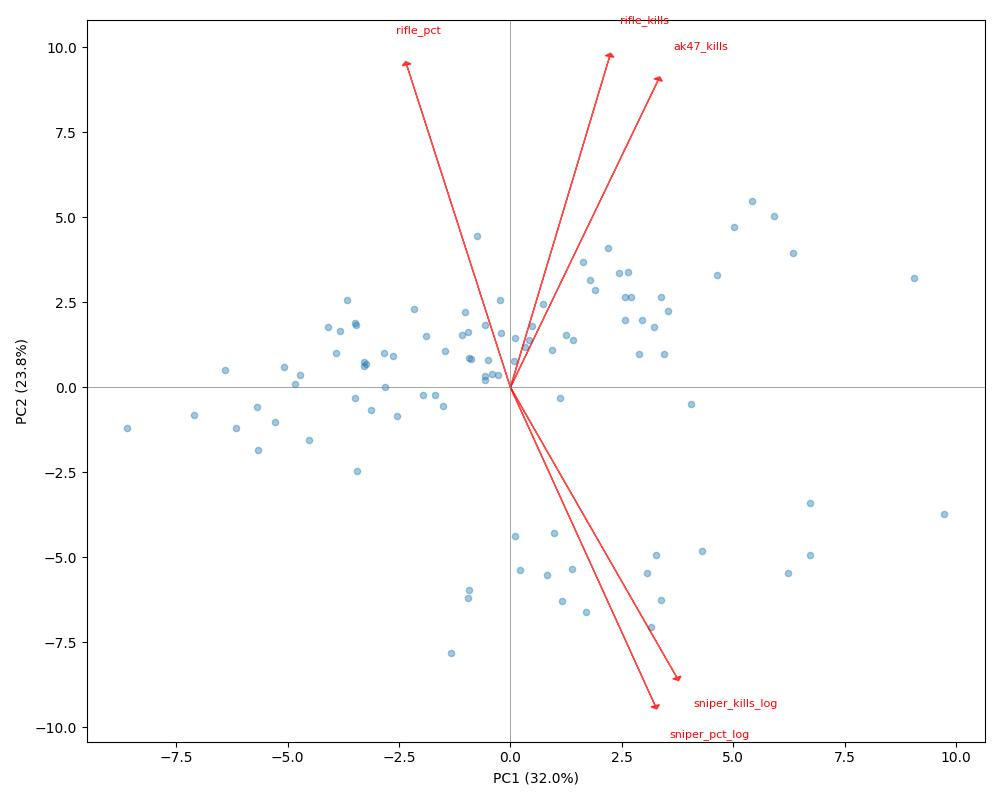

*Figure 2 – Biplot of player scores on PC1 and PC2. Red arrows show the loading directions of the five features with the largest combined magnitude across both components.*

---

### K-Means Clustering Analysis

  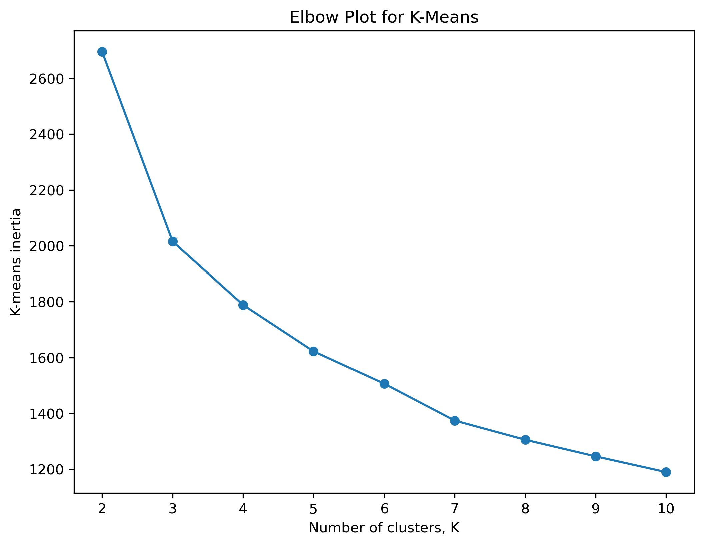

*Figure 3 – Elbow plot showing K-Means inertia across candidate values of k.*

  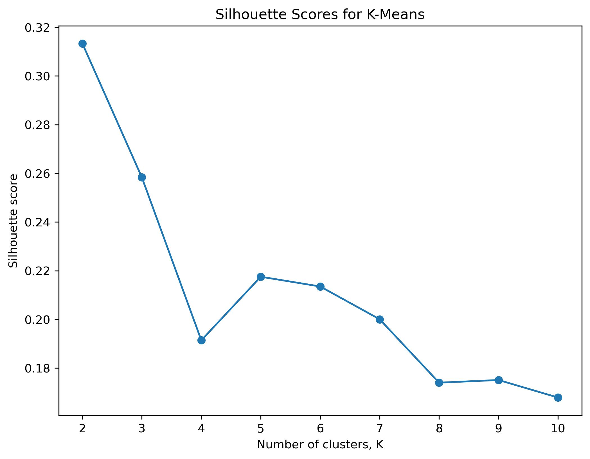

*Figure 4 – Silhouette scores for K-Means clustering across k = 2 through k = 10.*

K-Means clustering was applied to the PCA-reduced player representation using values of k that ranged from 2 through 10. Each model was run with 20 random initializations, retaining the solution with the lowest inertia for each value of k. We then plotted this and utilized the elbow method, though our final value of k was not solely determined by it.

Our silhouette analysis indicated that k = 2 produced the highest score, implying the cleanest statistical separation between groups. However, the solution proved overly coarse in practice, primarily separating players into broad AWPer-versus-rifler categories. While this may garner the highest silhouette score, we felt that this clustering collapsed several distinct rifling profiles into a single large group which did let us interpret the clusters in the way we wanted.

For this reason, the final analysis uses k = 3. Although its silhouette score is slightly lower, the additional cluster reveals a meaningful separation between average riflers/support players and elite high-impact star riflers. Thus we felt the tradeoff between statistical compactness and interpretability was worth using k=3 instead of k=2 in this case.

  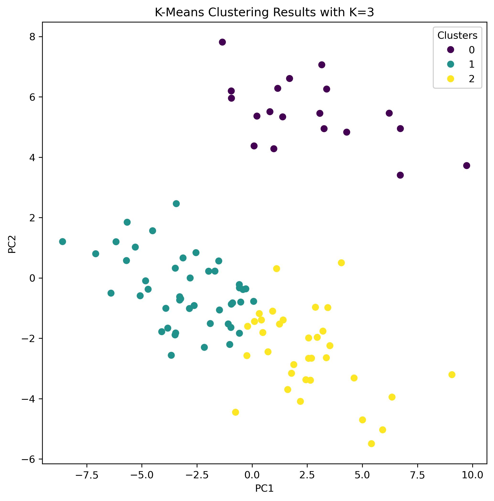

*Figure 5 – Final K-Means clustering projected onto the first two principal components.*

---

### Hierarchical Clustering Analysis

  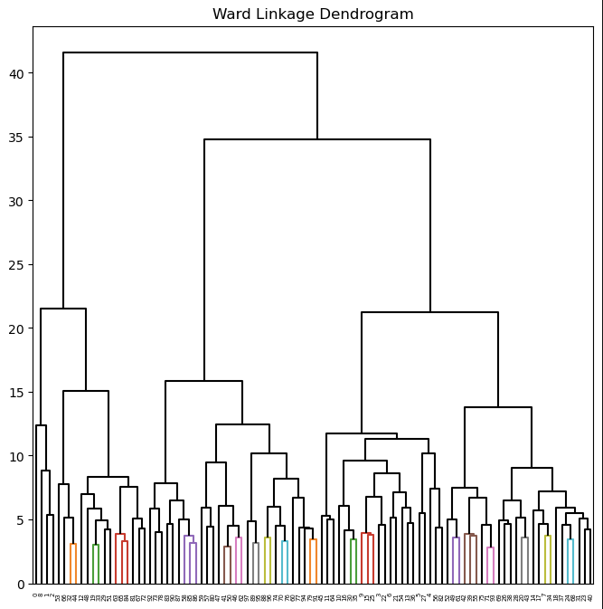

  <em>Figure 6 – Ward linkage dendrogram for the CS2 player dataset.</em>

  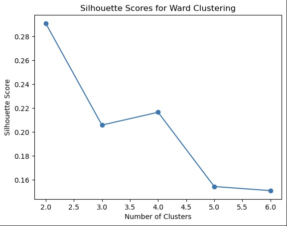

  <em>Figure 7 – Silhouette scores for Hierarchical clustering across k = 2 through k = 6.</em>

Hierarchical clustering was applied to the PCA-reduced player representation using four linkage methods: complete, average, single, and Ward linkage. After comparing the resulting dendrograms, ward linkage was selected for further analysis because it produced the most balanced and interpretable cluster structure.

Unlike K-Means, hierarchical clustering does not require the number of clusters to be specified during model fitting. Instead, the dendrogram in Figure 6 was used to examine the nested grouping structure of the data. The large vertical jumps near the top of the tree suggest that solutions with two or three clusters may capture most of the meaningful structure.

To further evaluate potential cluster solutions, silhouette scores were computed for values of k ranging from 2 through 6 (Figure 7). The highest silhouette score occurred at k = 2, indicating the strongest statistical separation between groups. However, inspection of the resulting clusters showed that this solution primarily separated dedicated AWP players into one cluster and then everyone else into the other.

The k = 4 solution produced a slightly higher silhouette score than k = 3, but it created a very small cluster containing only four observations, suggesting that it was isolating a handful of elite specialists rather than identifying a broadly meaningful player role. For this reason, the final analysis uses k = 3. Although its silhouette score is slightly lower than the k = 2 solution, it provides a better balance between cluster quality, interpretability, and size, revealing distinct groups corresponding to dedicated AWPers, riflers, and lower-output/support-oriented players.

---

## Discussion

### Breaking Down the Principal Components
As the original 40-dimensional feature space was decomposed into 9 principal components. the **rotation matrix** (`pca.components_`) tells you what each PC measures while the **scores** (`X`) tell you where each player stands on those measures.

Referring to Table 1:

**PC1 – Overall Performance.** Output-oriented metric such as KD_Ratio, KPR, and ROUND_SWING metric pulls positive. DPR and SMG percentage pull negative. As a result, this component is a composite skill index. High scores on PC1 mean more kills, fewer deaths, and more rounds swung in the team's favor. 

**PC2 – Weapon Style (AWP vs. Rifle).** The loadings split cleanly along weapon lines. Rifle_kills, rifle_pct, and ak47_kills load strongly positive while sniper_pct_log, sniper_kills_log, and awp_kills_log load strongly negative at nearly equal magnitude. Moving along PC2 from negative to positive means moving from dedicated AWPer to dedicated rifler. 

**PC3 – Playing Volume vs. Per-Round Impact.** Rounds_played, Maps_played, and Total_deaths dominate the positive side while ADR, Impact_rating, and MULTI_KILL pull negative. This axis separates players who accumulate rounds from those who are efficient per round. High PC3 scores point to the IGL and support role player profile. They have plenty of maps played, but below-average per-round output.

**PC4 – Economy Weapon Preference.** Pistol_pct and deagle_kills load positively while smg_kills and smg_pct load negatively. On eco and force-buy rounds, players either choose pistols or SMGs and this component distinguishes these two styles. The positive loading on Saved_teammates links the deagle-preference style to players who has higer aiming skills and tends to stay behide to trade rather than running with SMGs.

**PC5 through PC9** capture progressively narrower dimensions: CT-side survivability (PC5), M4A1-S vs. M4A1 preference (PC6 and PC7), teammate-save dynamics (PC8), and utility/grenade damage paired with assist rate (PC9). These later components explain relatively little variance individually but collectively cover meaningful structural variation that the first four miss.

The biplot in Figure 2 reveals a clear split along the PC2 axis. One band of players clusters toward negative PC2 values (AWPers, pulled by the sniper loading arrows), while the larger group sits at positive or near-zero PC2 (riflers). Within each band, players spread horizontally along PC1 according to overall performance level. This structure would be invisible in a plot of any two original features. Plotting Rating 3.0 against ADR shows only a diagonal performance band with no weapon-style separation, since both metrics are output measures regardless of weapon. Plotting rifle_kills against awp_kills shows the weapon split but loses all skill-level information.

### Breaking Down the K-Means Clustering

  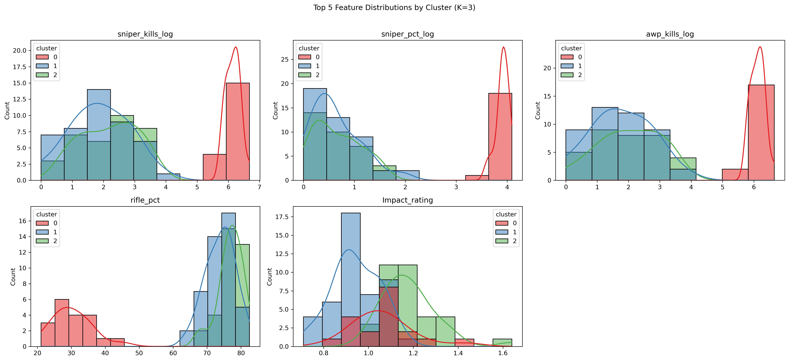

Figure 8 – Distribution of the five strongest cluster-defining variables across the (k = 3) K-Means solution.

To better understand how the clusters were formed, we examined the distributions of all features across the (k = 3) solution. Figure 6 highlights five of the most important variables driving cluster separation: sniper_kills_log, sniper_pct_log, awp_kills_log, rifle_pct, and Impact_rating.

The sniper-related metrics show the clearest separation, with Cluster 0 forming a completely distinct AWPer-heavy group. In contrast, Clusters 1 and 2 overlap heavily in sniper usage, confirming that both are primarily rifle-oriented players. The remaining variables, especially rifle_pct and Impact_rating, separate supportive riflers from elite carry players. Cluster 2 consistently occupies the high end of the impact distribution, while Cluster 1 centers around lower-impact but more utility-oriented profiles. Overall, these plots reinforce that the clustering captures meaningful gameplay archetypes rather than arbitrary statistical groupings. Thus the following are how we interpretted the clusters:

Cluster 0 – Dedicated AWPers

Cluster 0 is characterized by extremely high sniper-related metrics, with dramatically elevated values for sniper_kills_log, sniper_pct_log, and awp_kills_log, while maintaining relatively low rifle usage percentages. Players in this cluster also post strong overall ratings, high K/D ratios, and strong round-swing values. Statistically, this is the clearest and most distinct cluster in the dataset, strongly matching the traditional primary AWPer role: players who generate impact through opening picks, angle control, and low-death, high-value engagements rather than raw rifle volume. The comparatively lower headshot percentage in this cluster is also expected, since AWP kills do not require headshots.

Cluster 1 – Support / Low-Impact Riflers

Cluster 1 contains the lowest-performing statistical profiles overall. Players in this group have the lowest Rating 3.0, Impact Rating, ADR, KPR, and K/D ratio among all clusters, although they also show the highest grenade damage per round and relatively elevated assist rates. Weapon usage patterns indicate heavy rifle dependence but lower overall fragging efficiency. This statistical profile aligns closely with support players, anchor players, and some IGLs, whose responsibilities emphasize utility usage, site anchoring, and enabling teammates rather than maximizing personal output. Importantly, this cluster should not be interpreted as “bad players.” These are still elite professional competitors playing against top-20 opposition; rather, the cluster reflects players whose in-game responsibilities sacrifice individual statistical production for team structure and utility value.

Cluster 2 – Elite Star Riflers

Cluster 2 represents the highest-output riflers in the dataset. These players lead all clusters in Rating 3.0, ADR, KPR, Impact Rating, multi-kill percentage, and total rifle kills. Their extremely high AK-47 and M4 kill totals, combined with strong headshot percentages, indicate aggressive mechanically skilled riflers capable of consistently winning duels. Unlike Cluster 0, this group derives its impact primarily from rifle engagements rather than sniper specialization. The cluster captures the archetype of the modern star rifler: high-volume fraggers who create openings, dominate aim duels, and generate large amounts of round-winning damage. The distinction between Cluster 1 and Cluster 2 is especially important. Both are rifle-oriented groups, but Cluster 2 separates itself through substantially higher efficiency and impact metrics, suggesting that the clustering successfully distinguishes supportive riflers from elite carry-style players.

### Breaking Down the Hierarchical Clustering

  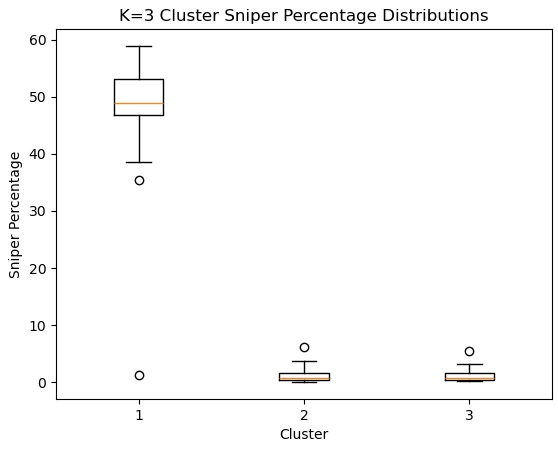
  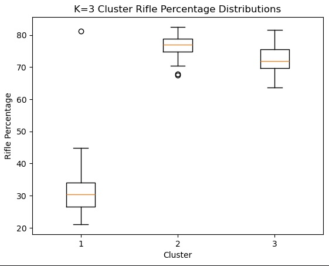
  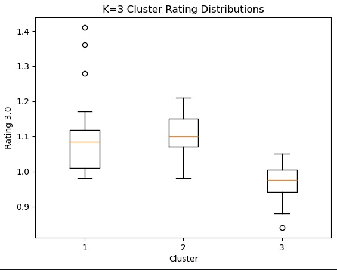

  <em>Figure 9 – Distribution of sniper percentage, rifle percentage, and Rating 3.0 across the final k = 3 hierarchical clustering solution.</em>

To further investigate whether professional CS2 players naturally separate into distinct statistical archetypes, we examined the distributions among the clusters created by different values of K for Hierarchical Clustering. Figure 9 highlights three key variables that proved useful in interpreting the resulting groups: sniper percentage, rifle percentage, and Rating 3.0.

The sniper percentage boxplot reveals the clearest separation. One cluster exhibits dramatically higher sniper percentages than the others, indicating a group of dedicated AWPers whose impact is generated primarily through sniper rifle gameplay. The remaining two clusters show consistently low sniper percentages, suggesting that both are predominantly rifle-oriented players and not snipers.

The rifle percentage distributions reinforce this interpretation. The two rifle-oriented clusters display substantially higher rifle usage than the AWPer cluster, confirming that the hierarchical clustering successfully separated players according to weapon specialization. While both groups rely heavily on rifles, they differ in overall performance characteristics.

The Rating 3.0 boxplot provides the distinction between these two rifle-oriented clusters. One group displays the highest median rating values and a concentration of strong individual performances, representing the elite high-skill riflers. The other cluster has lower rating values overall, suggesting a collection of support-oriented or lower-impact riflers whose contributions may be less visible through traditional fragging metrics.

Together, these distributions explain why the k = 3 solution was selected. The clustering not only isolates a distinct sniper archetype but also identifies a meaningful separation between elite star riflers and support-oriented riflers. This provides a more informative interpretation than the k = 2 solution, which primarily distinguished snipers/AWPers from everyone else.
